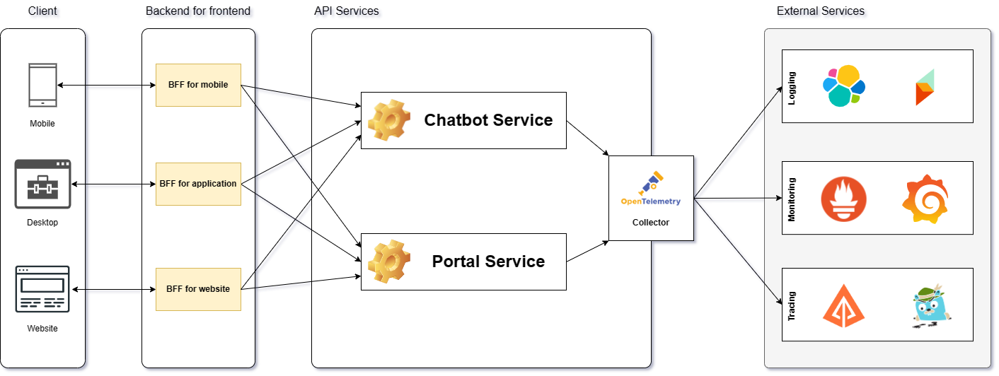

<h1 align="center">
	
	

Sao Viet Portal
</h1>

An open source portal built to manage student's information at Sao Viet.

	
	
	
	
	

# Table of Contents

- [Table of Contents](#table-of-contents)
- [Overview](#overview)
  - [Introduction](#introduction)
  - [Features](#features)
  - [Timeline](#timeline)
- [Technologies](#technologies)
- [Architecture](#architecture)
- [Getting Started](#getting-started)
  - [Prerequisites](#prerequisites)
  - [Installation locally](#installation-locally)
- [Documentation](#documentation)
- [Contributing](#contributing)
- [Sponsor](#sponsor)
- [Contact](#contact)
- [License](#license)
- [References](#references)

# Overview

## Introduction

The SaoViet Portal is a web and app-based platform designed for managers and administrators to efficiently manage student-related data and activities. The platform is intuitive, user-friendly, and accessible from anywhere, at any time. It features advanced security measures, customization options, and is designed to reduce paperwork, save time, and minimize errors.

<b>⚠️Note:</b> This project is currently in development. The project is a university graduation project, and is not intended to be used in production or for commercial purposes. The project is not affiliated with Sao Viet. HUTECH University is not responsible for any damage caused by the use of this project.

(<a href="#readme-top">back to top</a>)

## Features

- [x] Manage student's information, including personal information, academic information, and financial information.
- [x] Manage teacher information, including their personal details, qualifications, and employment history
- [x] Manage the different branches of the center, including their location, contact details, and available courses
- [x] Keep track of the center's financial activities, including income and expenses
- [x] Generate statistical data and reports based on the information stored in the system
- [x] Provides users with interactive chatbot interface that can assist with common queries and tasks
- [ ] Follow the center's teachers and students `(requires IoT devices)`
- [ ] Manage the assets of the center, including equipment, furniture, and other resources `(requires Grantt chart)`
- [ ] Analyze the center's financial data and generate revenue predictions based on trends and patterns
- [ ] Provide more advanced chatbot capabilities, using the latest GPT-4 technology
- [ ] Store student data on a secure blockchain platform, ensuring the privacy and security of sensitive information

(<a href="#readme-top">back to top</a>)

## Timeline

This project is currently in development. The following is the timeline of the project:

- [x] 2023-03-13: Project started.
- [x] 2023-03-14: Getting business requirements.
- [x] 2023-03-22: Designing the architecture and database.
- [ ] 2023-03-26: Developing the portal api.
- [ ] (TBD): Writing the api documentation.
- [ ] (TBD): Developing the portal web app.
- [ ] (TBD): Developing the portal application.
- [ ] (TBD): Researching and implementing chatbot.
- [ ] (TBD): Developing the chatbot.
- [ ] (TBD): Release the the portal.

(<a href="#readme-top">back to top</a>)

# Technologies

Sao Viet Portal utilizes various technologies to provide a robust and efficient platform for its users. The following are the technologies used in the application:

- .[NET Core 7.0](https://dotnet.microsoft.com/download/dotnet/7.0) - A free, cross-platform, open source developer platform for building many different types of applications.
- [Bicep](https://docs.microsoft.com/en-us/azure/azure-resource-manager/bicep/overview) - A Domain Specific Language for deploying Azure resources declaratively.
- [HCL](https://www.terraform.io/docs/language/index.html) - A declarative language that is designed to describe infrastructure in a concise way.
- [FastAPI](https://fastapi.tiangolo.com/) - A modern, fast, web framework for building APIs with Python 3.6+ based on standard Python type hints.
- [Apache Lucene](https://lucene.apache.org/) - A high-performance, full-featured text search engine library written entirely in Java.

And many more...

(<a href="#readme-top">back to top</a>)

# Architecture

The architecture of the application is designed to be highly scalable and flexible, which means that it can handle a large number of users and can easily adapt to changing needs and requirements. The following diagram shows the high-level components of the architecture:

The client compoment includes the web app, desktop app, and mobile app. The client component is responsible for handling user interactions and providing a graphical user interface for the application:

- `Web app`: The web app is using Blazor Server to provide a rich user interface for the application. It allows for a rich and responsive user interface while still maintaining the security and scalability of server-side code.
- `Desktop app and mobile app`: The desktop app and mobile app are built using MAUI (Multi-platform App UI), a framework for building cross-platform apps for Windows, macOS, iOS, and Android.

The BFF (Backend for Frontend) component includes four different types of BFFs: BFF for mobile, BFF for desktop, BFF for website, and a portal service. The BFF component acts as a middle layer between the client component and the API service, providing an optimized API for each type of client.

The API service is the core component of the architecture and handles all business logic and data processing. It communicates with the BFF component to provide data to the client.

- `Chatbot Service`: For the undergraduate thesis project, the chatbot service will not be implemented on GPT-4 but will require building a custom natural language processing model. All research on the chatbot service will be published in the school's research journal
- `Portal Service`: The portal service is a service that is responsible for managing the portal. It is responsible for managing the portal, including managing the portal's users, managing the portal's content, and managing the portal's settings.

The architecture also includes an OpenTelemetry collector, which collects telemetry data from all components of the system and sends it to external services for analysis. External services used in the architecture include logging, monitoring, and tracing services. The logging service includes the following services:

- `ELK Stack`: The ELK Stack is a collection
- `Seq`: Seq is a powerful log server that allows you to collect, search, and analyze log events from your applications and services.
- `Prometheus`: Prometheus is an open-source systems monitoring and alerting toolkit originally built at SoundCloud.
- `Grafana`: Grafana is an open source, feature rich metrics dashboard and graph editor for Graphite, Elasticsearch, OpenTSDB, Prometheus and InfluxDB.
- `Zipkin`: Zipkin is a distributed tracing system.
- `Jaeger`: Jaeger, inspired by Dapper and OpenZipkin, is a distributed tracing system released as open source by Uber Technologies

Overall, the architecture is designed to provide a scalable, flexible, and efficient application that can handle a large volume of users while also adapting to changing needs and requirements.

The detailed architecture of the application is shown in documentation at [here](#).

You also can see the architecture at wiki at [here](#).

(<a href="#readme-top">back to top</a>)

# Getting Started

## Prerequisites

`Will be updated soon`

## Installation locally

`Will be updated soon`

# Documentation

- See the changelog at [here](./CHANGELOG.md).
- See documentation on how to use the API at [here](./docs/README.md).
- See the wiki at [here](https://github.com/foxminchan/SaoVietPortal/wiki).
- See code of conduct at [here](./CODE_OF_CONDUCT.md).
- See contributing guidelines at [here](./.github/CONTRIBUTING.md).
- See privacy policy at [here](./SECURITY.md).
- See the article about the project at [here](#).
- See the support at [here](./.github/SUPPORT.md).

(<a href="#readme-top">back to top</a>)

# Contributing

We welcome contributions from the community. If you would like to contribute to this project, please read our <a href="./.github/CONTRIBUTING.md">contributing guidelines</a> for more information.

<table align="center">
  <tbody>
	<tr>
		<td align="center"><a href="https://github.com/foxminchan"> <b>Nguyen Xuan Nhan</b></a> <a href="https://github.com/foxminchan/SaoVietAPI/commits?author=foxminchan" title="Code">💻</a></td>
		<td align="center"><a href="https://github.com/lycaphe8x"> <b>Nguyen Dinh Anh</b></a> <a href="#" title="Guide">🧑‍🏫</a></td>
	</tr>
  </tbody>
</table>

(<a href="#readme-top">back to top</a>)

# Sponsor

I'm looking for sponsors to help me maintain and develop this project.

If you are interested in sponsoring this project, please contact me at [here](mailto:nguyenxuannhan407@gmail.com) or use button `Sponsor` at the top of this page.

(<a href="#readme-top">back to top</a>)

# Contact

If you have any questions, please contact me at [here](mailto:nguyenxuannhan407@gmail.com)

For contact to my instructor, please contact him at [here](mailto:nd.and@hutech.edu.vn)

(<a href="#readme-top">back to top</a>)

# License

The Sao Viet Portal project is governed by two distinct licenses. The first license, the MIT License, applies to the codebase of the project. The MIT License permits the use, modification, and distribution of the codebase under certain conditions. The full terms of the MIT License can be found in the <a href="./LICENSE">MIT</a> file.

The second license, the Attribution 4.0 International License, applies to the documentation of the project. This license permits the use, reproduction, and distribution of the documentation provided that proper attribution is given to the original authors. The full terms of the Attribution 4.0 International License can be found in the <a href="./LICENSE-docs">LICENSE-docs</a> file.

Sao Viet Portal is not affiliated with Microsoft, Azure, or any other Microsoft products. All product are developed and copyrignt by <a href="https://github.com/foxminchan">Nguyen Xuan Nhan</a> and <a href="https://github.com/lycaphe8x">Nguyen Dinh Anh</a>.

<a href="mailto:nd.and@hutech.edu.vn">Nguyen Dinh Anh</a>, a lecturer at `Hutech University` is co-owner of this project. The Faculty of Information Technology at `Hutech University` will be will act as the project evaluation and grading committee.

For more information about the project's copyright, please refer to the <a href="./COPYRIGHT.txt">COPYRIGHT</a> file. All rights reserved.

(<a href="#readme-top">back to top</a>)

# References

- [ASP.NET Core in Action, Third Edition (MEAP v06)](https://www.manning.com/books/asp-net-core-in-action-third-edition)
- [Web Development with Blazor - Second Edition](https://www.packtpub.com/product/web-development-with-blazor-second-edition/9781803241494)
- [Introducing .NET MAUI: Build and Deploy Cross-platform Applications Using C# and .NET Multi-platform App UI](https://www.oreilly.com/library/view/introducing-net-maui/9781484292341/)
- [High-Performance Web Apps with FastAPI: The Asynchronous Web Framework Based on Modern Python](https://www.oreilly.com/library/view/high-performance-web-apps/9781484291788/)
- [Infrastructure as Code with Azure Bicep: Streamline Azure resource deployment by bypassing ARM complexities](https://www.oreilly.com/library/view/infrastructure-as-code/9781801813747/B17805_FM_Epub.xhtml)
- [Beginning HCL Programming: Using Hashicorp Language for Automation and Configuration](https://www.oreilly.com/library/view/beginning-hcl-programming/9781484266342/)

Some useful links:

- [Azure DevOps](https://azure.microsoft.com/en-us/services/devops/)
- [Terraform Language Documentation](https://www.terraform.io/docs/language/index.html)
- [DevOps for ASP.NET Core Developers](https://docs.microsoft.com/en-us/dotnet/architecture/devops-for-aspnet-developers/)
- [ASP.NET Core 6](https://www.pluralsight.com/paths/aspnet-core-6)

(<a href="#readme-top">back to top</a>)

