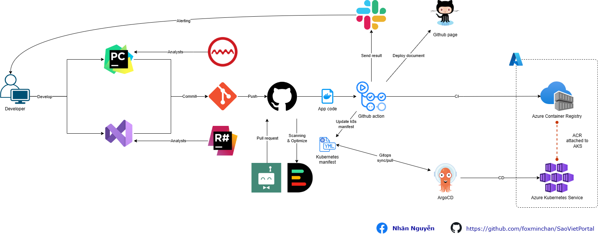
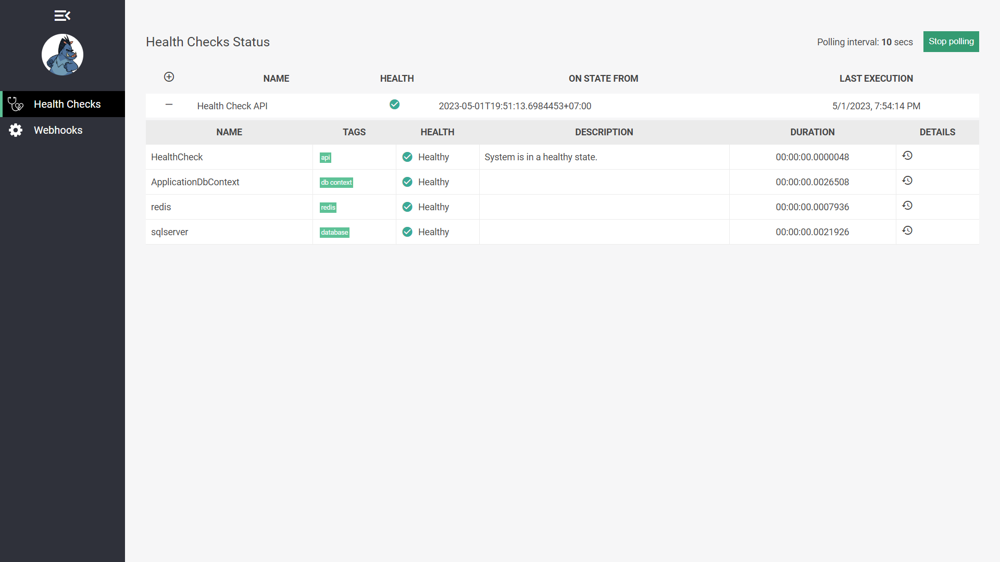

<h1 align="center">
	
	

Sao Viet Portal
</h1>

An open source portal built to manage student's information at Sao Viet.

	
	
	
	
	

# Table of Contents

- [Table of Contents](#table-of-contents)
- [Overview](#overview)
	- [Introduction](#introduction)
	- [Features](#features)
	- [Timeline](#timeline)
- [Technologies](#technologies)
- [Architecture](#architecture)
- [API development](#api-development)
- [Getting Started](#getting-started)
	- [💻 Infrastructure](#-infrastructure)
	- [🛠️ Backend](#️-backend)
	- [🖥️ Frontend](#️-frontend)
	- [📦 Optional tools](#-optional-tools)
- [OpenAPI](#openapi)
- [CI/CD](#cicd)
- [External Services](#external-services)
	- [🧑‍⚕️ Health Check](#️-health-check)
	- [📝 Logging](#-logging)
	- [📊 Monitoring](#-monitoring)
	- [📈 Tracing](#-tracing)
- [Documentation](#documentation)
- [Contributing](#contributing)
- [Sponsor](#sponsor)
- [Contact](#contact)
- [License](#license)
- [References](#references)

# Overview

## Introduction

The SaoViet Portal is a web and app-based platform designed for managers and administrators to efficiently manage student-related data and activities. The platform is intuitive, user-friendly, and accessible from anywhere, at any time. It features advanced security measures, customization options, and is designed to reduce paperwork, save time, and minimize errors.

<b>⚠️Note:</b> This project is currently in development. The project is a university graduation project, and is not intended to be used in production or for commercial purposes. The project is not affiliated with Sao Viet. HUTECH University is not responsible for any damage caused by the use of this project.

(<a href="#readme-top">back to top</a>)

## Features

- [x] Manage student's information, including personal information, academic information, and financial information.
- [x] Manage teacher information, including their personal details, qualifications, and employment history
- [x] Manage the different branches of the center, including their location, contact details, and available courses
- [x] Keep track of the center's financial activities, including income and expenses
- [x] Generate statistical data and reports based on the information stored in the system
- [x] Provides users with interactive chatbot interface that can assist with common queries and tasks
- [ ] Follow the center's teachers and students `(requires IoT devices)`
- [ ] Manage the assets of the center, including equipment, furniture, and other resources `(requires Grantt chart)`
- [ ] Analyze the center's financial data and generate revenue predictions based on trends and patterns
- [ ] Provide more advanced chatbot capabilities, using the latest GPT-4 technology
- [ ] Store student data on a secure blockchain platform, ensuring the privacy and security of sensitive information

(<a href="#readme-top">back to top</a>)

## Timeline

This project is currently in development. The following is the timeline of the project:

- [x] 2023-03-13: Project started.
- [x] 2023-03-14: Getting business requirements.
- [x] 2023-03-22: Designing the architecture and database.
- [x] 2023-03-26: Developing the portal api.
- [ ] 2023-05-06: Developing the backend for frontend.
- [ ] 2023-05-08: Writing the api documentation.
- [ ] (TBD): Developing the portal web app.
- [ ] (TBD): Developing the portal application.
- [ ] (TBD): Researching and implementing chatbot.
- [ ] (TBD): Developing the chatbot.
- [ ] (TBD): Release the the portal.

(<a href="#readme-top">back to top</a>)

# Technologies

Sao Viet Portal utilizes various technologies to provide a robust and efficient platform for its users. The following are the technologies used in the application:

- .[NET Core 7.0](https://dotnet.microsoft.com/download/dotnet/7.0) - A free, cross-platform, open source developer platform for building many different types of applications.
- [Bicep](https://docs.microsoft.com/en-us/azure/azure-resource-manager/bicep/overview) - A Domain Specific Language for deploying Azure resources declaratively.
- [HCL](https://www.terraform.io/docs/language/index.html) - A declarative language that is designed to describe infrastructure in a concise way.
- [FastAPI](https://fastapi.tiangolo.com/) - A modern, fast, web framework for building APIs with Python 3.6+ based on standard Python type hints.
- [Apache Lucene](https://lucene.apache.org/) - A high-performance, full-featured text search engine library written entirely in Java.
- [Pytorch](https://pytorch.org/) - An open source machine learning framework that accelerates the path from research prototyping to production deployment.
- [Duende](https://duendesoftware.com/products/identityserver) - A free, open source OpenID Connect and OAuth 2.0 framework for ASP.NET Core.

And many more...

(<a href="#readme-top">back to top</a>)

# Architecture

The architecture of the application is designed to be highly scalable and flexible, which means that it can handle a large number of users and can easily adapt to changing needs and requirements. The following diagram shows the high-level components of the architecture:

  

<table align="center">
	<thead>
		<th>Name</th>
		<th>UseCase</th>
		<th>Technology</th>
	</thead>
	<tbody>
		<tr>
			<td><b>User</b></td>
			<td>N/A</td>
    	<td>N/A</td>
		</tr>
		<tr>
			<td><b>Client</b></td>
			<td align="justify">A client is a user who uses the application with a web browser or mobile app and desktop app to access the application.</td>
			<td>Blazor Server, .NET MAUI</td>
		</tr>
		<tr>
			<td><b>Back end for Front end</b></td>
			<td align="justify">A back end for front end is a server that is used by the client to access the application. It is responsible for handling requests from the client and returning responses to the client.</td>
			<td>ASP.NET Core, Duende IdentityServer 4</td>
		</tr>
		<tr>
				<td><b>Server</b></td>
				<td align="justify">A server is a computer that is used to host the application. It is responsible for handling requests from the client and returning responses to the client. It is also responsible for storing data in a database.</td>
				<td>ASP.NET Core, FastAPI, Kafka, etc.</td>
		</tr>
		<tr>
				<td><b>Database</b></td>
				<td align="justify">A database is a collection of data that is stored in a computer. It is used to store data in a structured way so that it can be easily accessed and manipulated.</td>
				<td>SQL Server 2022, Apache Lucene, Redis</td>
		</tr>
		<tr>
				<td><b>Opentelemetry</b></td>
				<td align="justify">Opentelemetry is a set of open source tools that are used to monitor and trace applications. It is used to collect metrics and traces from the application and send them to a monitoring system.</td>
				<td>Zipkin, Jaeger, Prometheus, Grafana, ELK Stack, Seq</td>
		</tr>
		<tr>
				<td><b>Email System</b></td>
				<td align="justify">An email system is a system that is used to send emails. It is used to send emails to users.</td>
				<td>Microsoft exchange server</td>
		</tr>
	</tbody>
</table>

(<a href="#readme-top">back to top</a>)

# API development

  

Learn more about the Clean Architecture [here](https://docs.microsoft.com/en-us/dotnet/architecture/modern-web-apps-azure/common-web-application-architectures#clean-architecture).

(<a href="#readme-top">back to top</a>)

# Getting Started

## 💻 Infrastructure

- **[`Windows 11`](https://www.microsoft.com/en-us/windows/windows-11)** - The operating system for developing and building this application.
- **[`WSL 2 - Ubuntu 22.04.2 LTS`](https://docs.microsoft.com/en-us/windows/wsl/install)** - The subsystem for Linux to run Linux on Windows.
- **[`Docker Desktop (Kubernetes enabled)`](https://www.docker.com/products/docker-desktop)** - The containerization platform to run the application.
- **[`Kubernetes`](https://kubernetes.io/)** / **[`AKS`](https://azure.microsoft.com/en-us/services/kubernetes-service/)** / **[`Nomad`](https://www.nomadproject.io/)** - The container orchestration system to deploy the application.
- **[`helm`](https://helm.sh/)** - The package manager for Kubernetes to install the application.
- **[`tye`](https://github.com/dotnet/tye)** - The tool to run the application locally.
- **[`Postman`](https://www.postman.com/)** / **[`Insomnia`](https://insomnia.rest/)** / **[`REST Client`](https://marketplace.visualstudio.com/items?itemName=humao.rest-client)** - The tool to test the application.

## 🛠️ Backend

- **[`.NET Core 7.0`](https://dotnet.microsoft.com/download/dotnet/7.0)** - A free, cross-platform, open source developer platform for building many different types of applications.
- **[`Duende BFF`](https://duendesoftware.com/products/identityserver)** - A free, open source OpenID Connect and OAuth 2.0 framework for ASP.NET Core.
- **[`EF Core`](https://docs.microsoft.com/en-us/ef/core/)** - A modern object-database mapper for .NET.
- **[`OpenTelemetry`](https://opentelemetry.io/)** - A set of open source tools for monitoring and tracing applications.
- **[`Serilog`](https://serilog.net/)** - A diagnostic logging library for .NET applications.
- **[`FluentValidation`](https://fluentvalidation.net/)** - A popular .NET library for building strongly-typed validation rules.
- **[`AutoMapper`](https://automapper.org/)** - A convention-based object-object mapper.
- **[`Lucene.NET`](https://lucenenet.apache.org/)** - A high-performance, full-featured text search engine library.
- **[`FastAPI`](https://fastapi.tiangolo.com/)** - A modern, fast (high-performance), web framework for building APIs with Python 3.6+ based on standard Python type hints.
- **[`Pytorch`](https://pytorch.org/)** - An open source machine learning framework that accelerates the path from research prototyping to production deployment.
- **[`Apache Kafka`](https://kafka.apache.org/)** - A distributed streaming platform.

## 🖥️ Frontend

- **[`Blazor`](https://dotnet.microsoft.com/apps/aspnet/web-apps/blazor)** - A free, open source framework for building client web apps with .NET.
- **[`.NET MAUI`](https://dotnet.microsoft.com/en-us/apps/maui)** - Build native, cross-platform desktop and mobile apps all in one framework.
- **[`Docusaurus`](https://docusaurus.io/)** - Build optimized websites quickly, focus on your content.

## 📦 Optional tools

- **[`Visual Studio 2022`](https://visualstudio.microsoft.com/vs/)** - The IDE for developing and building this application.
- **[`SQL Server 2022`](https://www.microsoft.com/en-us/sql-server/sql-server-downloads)** - The relational database management system to store data.
- **[`Laragon`](https://laragon.org/)** - Modern & Powerful - Easy Operation.
- **[`Resharper`](https://www.jetbrains.com/resharper/)** - The Visual Studio extension for .NET developers.
- **[`PyCharm`](https://www.jetbrains.com/pycharm/)** - The Python IDE for Professional Developers.

(<a href="#readme-top">back to top</a>)

# OpenAPI

  

✅ <b>Info:</b> I have implemented ReDoc with the OpenAPI specification is a great way to generate documentation for your API quickly and easily.

For details on how to use the API, see the [Docusaurus](https://foxminchan.github.io/SaoVietPortal/) documentation.

(<a href="#readme-top">back to top</a>)

# CI/CD

  

(<a href="#readme-top">back to top</a>)

# External Services

## 🧑‍⚕️ Health Check

For the API health check, I have used the <b>ASP.NET Core Health Checks</b> library to monitor the health of the application. The health check endpoint is exposed at <b>/hc</b> or <b>/hc-ui</b> and can be accessed via HTTP GET.

	

## 📝 Logging

I set up the <b>Elasticsearch</b>, <b>Kibana</b> and <b>Logstash</b> services to collect and analyze logs.

	

I also used the <b>Seq</b> service to collect and analyze logs.

	

## 📊 Monitoring

For the monitoring service, I have used the <b>Prometheus</b> and <b>Grafana</b> services to collect and analyze metrics.

	

	

## 📈 Tracing

For the tracing service, I have used the <b>Jaeger</b> service to collect and analyze traces.

	

I also used the, <b>Zipkin</b> service to collect and analyze traces.

	

(<a href="#readme-top">back to top</a>)

# Documentation

- See the changelog at [here](./CHANGELOG.md).
- See documentation on how to use the API at [here](https://foxminchan.github.io/SaoVietPortal/)
- See the wiki at [here](https://github.com/foxminchan/SaoVietPortal/wiki).
- See code of conduct at [here](./CODE_OF_CONDUCT.md).
- See privacy policy at [here](./SECURITY.md).
- See all articles about the project at [here](./resources/articles/).
- See the support at [here](./.github/SUPPORT.md).

(<a href="#readme-top">back to top</a>)

# Contributing

We welcome contributions from the community. If you would like to contribute to this project, please read our <a href="./.github/CONTRIBUTING.md">contributing guidelines</a> for more information.

Thanks goes to these wonderful people ([emoji key](https://allcontributors.org/docs/en/emoji-key))

<table align="center">
  <tbody>
    <tr>
      <td align="center">
        <a href="https://github.com/foxminchan">
          
           
          
            <b>Nguyen Xuan Nhan</b>
          
        </a>
         
				🤔
        <a href="https://github.com/foxminchan/SaoVietAPI/commits?author=foxminchan" title="Code">💻</a>
				📖
				⚠️
				🚧
				🐛
      </td>
      <td align="center">
        <a href="https://github.com/lycaphe8x">
          
           
          
            <b>Nguyen Dinh Anh</b>
          
        </a>
         
        🧑‍🏫
				💼
				📓
      </td>
    </tr>
  </tbody>
</table>

Wanna be here? [Contribute](./.github/CONTRIBUTING.md).

- Fork this repository.
- Create your new branch with your feature: `git checkout -b my-feature`.
- Commit your changes: `git commit -am 'feat: My new feature'`.
- Push to the branch: `git push origin my-feature`.
- Submit a pull request.

(<a href="#readme-top">back to top</a>)

# Sponsor

I'm looking for sponsors to help me maintain and develop this project. By sponsoring my project, you can help to ensure that I have the resources and infrastructure needed to provide the best possible experience for users.

Your support can help to cover the costs associated with hosting, maintenance, and development, as well as provide the resources needed to further improve and enhance my capabilities.

If you are interested in sponsoring this project, please don't hesitate to reach out to me at <a href="mailto:nguyenxuannhan407@gmail.com">here</a>  or use button `Sponsor` at the top of this page.

I would be more than happy to discuss the details of how your sponsorship can help to support my ongoing growth and development, and provide you with more information on the benefits and opportunities available to sponsors.

(<a href="#readme-top">back to top</a>)

# Contact

If you have any questions or concerns regarding my services, please don't hesitate to contact me at <a href="mailto:nguyenxuannhan407@gmail.com">here</a>.

If you need to get in touch with my instructor for any reason, please contact him at <a href="mailto:nd.and@hutech.edu.vn">here</a>.

Whether you have a question about my functionality, need help troubleshooting an issue, or simply want to provide feedback on your experience using my services, I am always happy to hear from users and welcome your input.

Thank you for your interest in my project, and I look forward to hearing from you soon.

(<a href="#readme-top">back to top</a>)

# License

The Sao Viet Portal project operates under two distinct licenses. The first license is the MIT License, which governs the project's codebase. This license permits the use, modification, and distribution of the codebase under certain conditions, as detailed in the <a href="./LICENSE">MIT file</a>.

The second license is the Attribution 4.0 International License, which applies to the project's documentation. This license allows for the use, reproduction, and distribution of the documentation provided that proper attribution is given to the original authors. The terms of the Attribution 4.0 International License can be found in the <a href="./LICENSE-docs">LICENSE-docs file</a>.

It is important to note that Sao Viet Portal is not affiliated with Microsoft, Azure, or any other Microsoft products. The project's products are developed and copyrighted by Nguyen Xuan Nhan and Nguyen Dinh Anh, with the latter being a lecturer at Hutech University. The Faculty of Information Technology at Hutech University will act as the project evaluation and grading committee.

For further information regarding the project's copyright, please refer to the <a href="./COPYRIGHT.txt">COPYRIGHT file</a>. All rights reserved.

(<a href="#readme-top">back to top</a>)

# References

- [ASP.NET Core in Action, Third Edition (MEAP v06)](https://www.manning.com/books/asp-net-core-in-action-third-edition)
- [Web Development with Blazor - Second Edition](https://www.packtpub.com/product/web-development-with-blazor-second-edition/9781803241494)
- [Introducing .NET MAUI: Build and Deploy Cross-platform Applications Using C# and .NET Multi-platform App UI](https://www.oreilly.com/library/view/introducing-net-maui/9781484292341/)
- [High-Performance Web Apps with FastAPI: The Asynchronous Web Framework Based on Modern Python](https://www.oreilly.com/library/view/high-performance-web-apps/9781484291788/)
- [Infrastructure as Code with Azure Bicep: Streamline Azure resource deployment by bypassing ARM complexities](https://www.oreilly.com/library/view/infrastructure-as-code/9781801813747/B17805_FM_Epub.xhtml)
- [Beginning HCL Programming: Using Hashicorp Language for Automation and Configuration](https://www.oreilly.com/library/view/beginning-hcl-programming/9781484266342/)

Some useful links:

- [Azure DevOps](https://azure.microsoft.com/en-us/services/devops/)
- [Terraform Language Documentation](https://www.terraform.io/docs/language/index.html)
- [DevOps for ASP.NET Core Developers](https://docs.microsoft.com/en-us/dotnet/architecture/devops-for-aspnet-developers/)
- [ASP.NET Core Fundamentals](https://www.pluralsight.com/courses/aspnet-core-fundamentals)

(<a href="#readme-top">back to top</a>)

