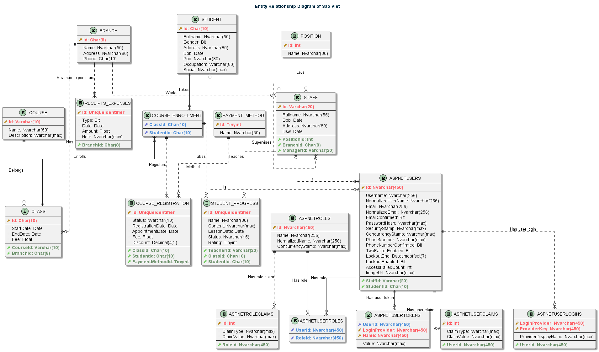

# Database Design

This section describes the database design for Sao Viet. The database is designed
using [MS SQL Server](https://www.microsoft.com/en-us/sql-server/sql-server-downloads). The database is designed to be
normalized to 3NF.

## Entity Relationship Diagram

## Database Schema

:::info
<b class="key">Attribute</b> - An unique identifier for each table.
:::

### Table: `Student`

<b>Description</b>: Student is a person who is studying at Sao Viet. A student can enroll in many courses. Each student has a unique student ID.

**Normal form:** BCNF

<table>
    <thead>
        <tr>
            <th>Column</th>
            <th>Type</th>
            <th>Required</th>
            <th>Description</th>
        </tr>
    </thead>
    <tbody>
        <tr>
            <td><b class="key">Id</b></td>
            <td>Char(10)</td>
            <td align="center">
            <label>
                <input type="checkbox" checked disabled />
            </label>
            </td>
            <td>
                An unique id for each student 
                Length must be 10 character long
            </td>
        </tr>
        <tr>
            <td>FullName</td>
            <td>Nvarchar(50)</td>
            <td align="center">
            <label>
                <input type="checkbox" checked disabled />
            </label>
            </td>
            <td>
                Full name of the student  
                Length must be less than 50 character long
            </td>
        </tr>
        <tr>
            <td>Gender</td>
            <td>Bit</td>
            <td align="center">
            <label>
                <input type="checkbox" checked disabled />
            </label>
            </td>
            <td>
                Sex of the student  
                True: Male  
                False: Female
            </td>
        </tr>
        <tr>
            <td>Address</td>
            <td>Nvarchar(80)</td>
            <td></td>
            <td align="justify">
                The student's address may include the ward, district, city, country, and other pertinent information.  
                Length must be less than 80 character long
            </td>
        </tr>
        <tr>
            <td>Dob</td>
            <td>Date</td>
            <td></td>
            <td>
                The student's date of birth  
                Date of birth must be in the past
            </td>
        </tr>
        <tr>
            <td>Pod</td>
            <td>Nvarchar(80)</td>
            <td></td>
            <td align="justify">
                The student's place of birth may include the ward, district, city, country, and other pertinent information.  
                Length must be less than 80 character long
            </td>
        </tr>
        <tr>
            <td>Occupation</td>
            <td>Nvarchar(80)</td>
            <td></td>
            <td align="justify">
                The student's occupation  
                Length must be less than 80 character long
            </td>
        </tr>
        <tr>
            <td>Social</td>
            <td>Nvarchar(max)</td>
            <td></td>
            <td align="justify">
                The student's social information may include their phone number, email, and social media profiles such as Facebook. This information should be in <code class="key">JSON</code> format and must contain the following fields: 
            <ul>
                    <li><code class="key">Name</code>: The name of the social network</li>
                    <li><code class="key">Link</code>: The URL to the student's profile on the social network</li>
                </ul>
            </td>
        </tr>
    </tbody>
</table>

### Table: `CourseEnrollment`

<b>Description</b>: Course enrollment is a relationship between a student and a course. A student can enroll in many courses. A course can have many students. Each CourseEnrollment has StudentId and CourseId as primary foreign keys.

**Normal form:** 3NF

<table>
    <thead>
        <tr>
            <th>Column</th>
            <th>Type</th>
            <th>Required</th>
            <th>Description</th>
        </tr>
    </thead>
    <tbody>
        <tr>
            <td><b class="key">StudentId</b></td>
            <td>Char(10)</td>
            <td align="center">
            <label>
                <input type="checkbox" checked disabled />
            </label>
            </td>
            <td align="justify">
                An unique identifier for each student, used as a foreign key to reference the <code class="key">Student</code> table. Must be 10 characters long and match an existing value in the <code class="key">Student</code> table.
            </td>
        </tr>
        <tr>
            <td><b class="key">CourseId</b></td>
            <td>Char(10)</td>
            <td align="center">
            <label>
                <input type="checkbox" checked disabled />
            </label>
            </td>
            <td align="justify">
                An unique identifier for each course, used as a foreign key to reference the <code class="key">Course</code> table. Must be 10 characters long and match an existing value in the <code class="key">Course</code> table.
            </td>
        </tr>
    </tbody>
</table>

### Table: `Course`

<b>Description</b>: Course is a class that students can enroll in. A course can have many students. Each course has a unique course ID.

**Normal form:** BCNF

<table>
    <thead>
        <tr>
            <th>Column</th>
            <th>Type</th>
            <th>Required</th>
            <th>Description</th>
        </tr>
    </thead>
    <tbody>
        <tr>
            <td><b class="key">Id</b></td>
            <td>Varchar(10)</td>
            <td align="center">
            <label>
                <input type="checkbox" checked disabled />
            </label>
            </td>
            <td>
                An unique id for each course 
                Length must be 10 character long
            </td>
        </tr>
        <tr>
            <td>Name</td>
            <td>Nvarchar(50)</td>
            <td align="center">
            <label>
                <input type="checkbox" checked disabled />
            </label>
            </td>
            <td>
                Name of the course  
                Length must be less than 50 character long
            </td>
        </tr>
        <tr>
            <td>Description</td>
            <td>Nvarchar(max)</td>
            <td></td>
            <td>
                A description of the course
            </td>
        </tr>
    </tbody>
</table>

### Table: `CourseRegistration`

<b>Description</b>: Course registration is a relationship child of course enrollment. A student can register for many courses. A course can have many students. Each course registration has StudentId and CourseId as foreign keys.

**Normal form:** BCNF

<table>
    <thead>
        <tr>
            <th>Column</th>
            <th>Type</th>
            <th>Required</th>
            <th>Description</th>
        </tr>
    </thead>
    <tbody>
        <tr>
            <td><b class="key">Id</b></td>
            <td>Uniqueidentifier</td>
            <td align="center">
            <label>
                <input type="checkbox" checked disabled />
            </label>
            </td>
            <td align="justify">
                An unique id for each student 
                Generated Guid from application
            </td>
        </tr>
        <tr>
            <td>Status</td>
            <td>Nvarchar(10)</td>
            <td align="center">
            <label>
                <input type="checkbox" checked disabled />
            </label>
            </td>
            <td align="justify">
                Indicates the registration status of the student in the course.  
                Must be one of the following values: Chốt, Hẹn, Huỷ
            </td>
        </tr>
        <tr>
            <td>ReregistrationDate</td>
            <td>Date</td>
            <td align="center">
            <label>
                <input type="checkbox" checked disabled />
            </label>
            </td>
            <td align="justify">
                The date the student registered for the course.
            </td>
        </tr>
        <tr>
            <td>AppointmentDate</td>
            <td>Date</td>
            <td>
            </td>
            <td align="justify">
                The date the student made an appointment for the registration of the course.  
                <code class="key">AppointmentDate</code> ≥ <code class="key">ReregistrationDate</code>
            </td>
        </tr>
        <tr>
            <td>Fee</td>
            <td>Float</td>
            <td>
            </td>
            <td align="justify">
                The fee the student has to pay for the course.  
                <code class="key">Fee</code> ≥ 0
            </td>
        </tr>
        <tr>
            <td>Discount</td>
            <td>Decimal(4,2)</td>
            <td>
            </td>
            <td align="justify">
                The discount the student has for the course.  
                <code class="key">Discount</code> ≥ 0 and <code class="key">Discount</code> ≤ 100
            </td>
        </tr>
        <tr>
            <td>StudentId</td>
            <td>Char(10)</td>
            <td align="center">
            <label>
                <input type="checkbox" checked disabled />
            </label>
            </td>
            <td align="justify">
                An unique identifier for each student, used as a foreign key to reference the <code class="key">Student</code> table. Must be 10 characters long and match an existing value in the <code class="key">Student</code> table.
            </td>
        </tr>
        <tr>
            <td>ClassId</td>
            <td>Char(10)</td>
            <td align="center">
            <label>
                <input type="checkbox" checked disabled />
            </label>
            </td>
            <td align="justify">
                An unique identifier for each class, used as a foreign key to reference the <code class="key">Class</code> table. Must be 10 characters long and match an existing value in the <code class="key">Class</code> table.
            </td>
        </tr>
        <tr>
            <td>PaymentMethodId</td>
            <td>Tinyint</td>
            <td>
            </td>
            <td align="justify">
                An unique identifier for each payment method, used as a foreign key to reference the <code class="key">PaymentMethod</code> table. Must be integer and match an existing value in the <code class="key">PaymentMethod</code> table.
            </td>
        </tr>
    </tbody>
</table>

### Table: `PaymentMethod`

<b>Description</b>: Payment method is a lookup table that contains the payment methods that students can use to pay for the course. Each payment method has a unique payment method ID.

**Normal form:** BCNF

<table>
    <thead>
        <tr>
            <th>Column</th>
            <th>Type</th>
            <th>Required</th>
            <th>Description</th>
        </tr>
    </thead>
    <tbody>
        <tr>
            <td><b class="key">Id</b></td>
            <td>Tinyint</td>
            <td align="center">
            <label>
                <input type="checkbox" checked disabled />
            </label>
            </td>
            <td>
                An unique id for each payment method 
                Must be integer and auto increment
            </td>
        </tr>
        <tr>
            <td>Name</td>
            <td>Nvarchar(50)</td>
            <td align="center">
            <label>
                <input type="checkbox" checked disabled />
            </label>
            </td>
            <td>
                Name of the payment method  
                Length must be less than 50 character long
            </td>
        </tr>
    </tbody>
</table>

### Table: `Class`

<b>Description</b>: Class is a lookup table that contains the classes that students can register for. Each class has a unique class ID.

**Normal form:** BCNF

<table>
    <thead>
        <tr>
            <th>Column</th>
            <th>Type</th>
            <th>Required</th>
            <th>Description</th>
        </tr>
    </thead>
    <tbody>
        <tr>
            <td><b class="key">Id</b></td>
            <td>Char(10)</td>
            <td align="center">
            <label>
                <input type="checkbox" checked disabled />
            </label>
            </td>
            <td>
                An unique id for each class 
                Length must be 10 character long
            </td>
        </tr>
        <tr>
            <td>StartDate</td>
            <td>Date</td>
            <td>
            </td>
            <td>
                The date the class starts
            </td>
        </tr>
        <tr>
            <td>EndDate</td>
            <td>Date</td>
            <td>
            </td>
            <td>
                The date the class ends  
                <code class="key">EndDate</code> ≥ <code class="key">StartDate</code>
            </td>
        </tr>
        <tr>
            <td>CourseId</td>
            <td>Varchar(10)</td>
            <td>
            </td>
            <td align="justify">
                An unique identifier for each course, used as a foreign key to reference the <code class="key">Course</code> table. Must be less than 10 characters long and match an existing value in the <code class="key">Course</code> table.
            </td>
        </tr>
        <tr>
            <td>BranchId</td>
            <td>Char(8)</td>
            <td>
            </td>
            <td align="justify">
                An unique identifier for each branch, used as a foreign key to reference the <code class="key">Branch</code> table. Must be 8 characters long and match an existing value in the <code class="key">Branch</code> table.
            </td>
        </tr>
    </tbody>
</table>

### Table: `Branch`

<b>Description</b>: Branch is a lookup table that contains the branches that students can register for. Each branch has a unique branch ID.

**Normal form:** BCNF

<table>
    <thead>
        <tr>
            <th>Column</th>
            <th>Type</th>
            <th>Required</th>
            <th>Description</th>
        </tr>
    </thead>
    <tbody>
        <tr>
            <td><b class="key">Id</b></td>
            <td>Char(8)</td>
            <td align="center">
            <label>
                <input type="checkbox" checked disabled />
            </label>
            </td>
            <td>
                An unique id for each branch 
                Length must be 8 character long
            </td>
        </tr>
        <tr>
            <td>Name</td>
            <td>Nvarchar(50)</td>
            <td>
            </td>
            <td>
                Name of the branch  
                Length must be less than 50 character long
            </td>
        </tr>
        <tr>
            <td>Address</td>
            <td>Nvarchar(80)</td>
            <td>
            </td>
            <td align="justify">
                The branch's address may include the ward, district, city, country, and other pertinent information.  
                Length must be less than 80 character long
            </td>
        </tr>
        <tr>
            <td>Phone</td>
            <td>Char(10)</td>
            <td>
            </td>
            <td align="justify">
                The branch's phone number  
                Length must be 10 character long  
                Regex: \d&#123;10&#125;
            </td>
        </tr>
    </tbody>
</table>

### Table: `StudentProgress`

<b>Description</b>: Student progress is a lookup table that contains the progress of students in a class. Each student progress has a unique student progress ID.

**Normal form:** BCNF

<table>
    <thead>
        <tr>
            <th>Column</th>
            <th>Type</th>
            <th>Required</th>
            <th>Description</th>
        </tr>
    </thead>
    <tbody>
        <tr>
            <td><b class="key">Id</b></td>
            <td>Uniqueidentifier</td>
            <td align="center">
            <label>
                <input type="checkbox" checked disabled />
            </label>
            </td>
            <td align="justify">
                An unique id for each student progress 
                Generated Guid from application
            </td>
        </tr>
        <tr>
            <td>Name</td>
            <td>Nvarchar(80)</td>
            <td align="center">
            <label>
                <input type="checkbox" checked disabled />
            </label>
            </td>
            <td align="justify">
                A lesson name of the student progress  
                Length must be less than 80 character long
            </td>
        </tr>
        <tr>
            <td>Content</td>
            <td>Nvarchar(max)</td>
            <td>
            </td>
            <td align="justify">
                The content of the lesson
            </td>
        </tr>
        <tr>
            <td>LessonDate</td>
            <td>Date</td>
            <td>
            </td>
            <td align="justify">
                The date of the lesson  
                <code class="key">LessonDate</code> ≥ <code class="key">StartDate</code> and <code class="key">LessonDate</code> ≤ <code class="key">EndDate</code> and must be in the past
            </td>
        </tr>
        <tr>
            <td>Status</td>
            <td>Char(10)</td>
            <td>
            </td>
            <td align="justify">
                The status of the lesson  
                Must be one of the following values: Vắng học, Miễn học, Hoàn thành
            </td>
        </tr>
        <tr>
            <td>Ratings</td>
            <td>Tinyint</td>
            <td>
            </td>
            <td align="justify">
                The rating of the lesson  
                Must be between 0 and 10
            </td>
        </tr>
        <tr>
            <td>TeacherId</td>
            <td>Varchar(20)</td>
            <td>
            </td>
            <td align="justify">
                An unique identifier for each teacher, used as a foreign key to reference the <code class="key">Teacher</code> table. Must be less than 20 characters long and match an existing value in the <code class="key">Teacher</code> table.
            </td>  
        </tr>
        <tr>
            <td>StudentId</td>
            <td>Char(10)</td>
            <td>
            </td>
            <td align="justify">
                An unique identifier for each student, used as a foreign key to reference the <code class="key">Student</code> table. Must be 10 characters long and match an existing value in the <code class="key">Student</code> table.
            </td>
        </tr>
        <tr>
            <td>ClassId</td>
            <td>Char(10)</td>
            <td>
            </td>
            <td align="justify">
                An unique identifier for each class, used as a foreign key to reference the <code class="key">Class</code> table. Must be 10 characters long and match an existing value in the <code class="key">Class</code> table.
            </td>
        </tr>
    </tbody>
</table>

### Table: `Postion`

<b>Description</b>: Position is a lookup table that contains the position of teachers. Each position has a unique position ID.

**Normal form:** BCNF

<table>
    <thead>
        <tr>
            <th>Column</th>
            <th>Type</th>
            <th>Required</th>
            <th>Description</th>
        </tr>
    </thead>
    <tbody>
        <tr>
            <td><b class="key">Id</b></td>
            <td>Int</td>
            <td align="center">
            <label>
                <input type="checkbox" checked disabled />
            </label>
            </td>
            <td>
                An unique id for each position 
                Must be integer and auto increment
            </td>
        </tr>
        <tr>
            <td>Name</td>
            <td>Nvarchar(30)</td>
            <td align="center">
            <label>
                <input type="checkbox" checked disabled />
            </label>
            </td>
            <td>
                Name of the position  
                Length must be less than 30 character long
            </td>
        </tr>
    </tbody>
</table>

### Table: `Staff`

<b>Description</b>: Staff is a lookup table that contains the information of staffs. Each staff has a unique staff ID.

**Normal form:** BCNF

<table>
    <thead>
        <tr>
            <th>Column</th>
            <th>Type</th>
            <th>Required</th>
            <th>Description</th>
        </tr>
    </thead>
    <tbody>
        <tr>
            <td><b class="key">Id</b></td>
            <td>VarChar(20)</td>
            <td align="center">
            <label>
                <input type="checkbox" checked disabled />
            </label>
            </td>
            <td>
                An unique id for each staff 
                Must be less than 20 character long
            </td>
        </tr>
        <tr>
            <td>FulName</td>
            <td>Nvarchar(55)</td>
            <td align="center">
            <label>
                <input type="checkbox" checked disabled />
            </label>
            </td>
            <td>
                Name of the staff  
                Length must be less than 55 character long
            </td>
        </tr>
                <tr>
            <td>Dob</td>
            <td>Date</td>
            <td></td>
            <td>
                The staff's date of birth  
                Date of birth must be in the past
            </td>
        </tr>
        <tr>
            <td>Address</td>
            <td>Nvarchar(80)</td>
            <td></td>
            <td align="justify">
                The staff's address may include the ward, district, city, country, and other pertinent information.  
                Length must be less than 80 character long
            </td>
        </tr>
        <tr>
            <td>Dsw</td>
            <td>Date</td>
            <td></td>
            <td>
                The staff's date of start working
            </td>
        </tr>
        <tr>
            <td>PositionId</td>
            <td>Int</td>
            <td  align="center">
            <label>
                <input type="checkbox" checked disabled />
            </label>
            </td>
            <td align="justify">
                An unique identifier for each position, used as a foreign key to reference the <code class="key">Position</code> table. Must be integer and match an existing value in the <code class="key">Position</code> table.
            </td>
        </tr>
        <tr>
            <td>BranchId</td>
            <td>Char(8)</td>
            <td align="center">
            <label>
                <input type="checkbox" checked disabled />
            </label>
            </td>
            <td align="justify">
                An unique identifier for each branch, used as a foreign key to reference the <code class="key">Branch</code> table. Must be 8 characters long and match an existing value in the <code class="key">Branch</code> table.
            </td>
        </tr>
        <tr>
            <td>ManagerId</td>
            <td>Varchar(20)</td>
            <td align="center">
            <label>
                <input type="checkbox" checked disabled />
            </label>
            </td>
            <td align="justify">
                An unique identifier for each manager, used as a foreign key to reference the <code class="key">Manager</code> table. Must be less than 20 characters long and match an existing value in the <code class="key">Manager</code> table.
            </td>
        </tr>
    </tbody>
</table>

### Table: `ReceiptExpense`

<b>Description</b>: ReceiptExpense is a lookup table that contains the information of receipt expenses. Each receipt expense has a unique receipt expense ID.

**Normal form:** BCNF

<table>
    <thead>
        <tr>
            <th>Column</th>
            <th>Type</th>
            <th>Required</th>
            <th>Description</th>
        </tr>
    </thead>
    <tbody>
        <tr>
            <td><b class="key">Id</b></td>
            <td>UniqueIdentifier</td>
            <td align="center">
            <label>
                <input type="checkbox" checked disabled />
            </label>
            </td>
            <td>
                An unique id for each receipt expense 
                Generated Guid from application
            </td>
        </tr>
        <tr>
            <td>Type</td>
            <td>Bit</td>
            <td align="center">
            <label>
                <input type="checkbox" checked disabled />
            </label>
            </td>
            <td>
            <ul>
                <li>0: Expense</li>
                <li>1: Receipt</li>
            </ul>
            </td>
        </tr>
        <tr>
            <td>Date</td>
            <td>Date</td>
            <td></td>
            <td>
                The date of the receipt expense
            </td>
        </tr>
        <tr>
            <td>Amount</td>
            <td>Float</td>
            <td align="center">
            <label>
                <input type="checkbox" checked disabled />
            </label>
            </td>
            <td>
                The amount of the receipt expense  
                Must be greater than 0
            </td>
        </tr>
        <tr>
            <td>Note</td>
            <td>Nvarchar(max)</td>
            <td>
            </td>
            <td align="justify">
                The note of the receipt expense
            </td>
        </tr>
        <tr>
            <td>BranchId</td>
            <td>Char(8)</td>
            <td>
            </td>
            <td align="justify">
                An unique identifier for each branch, used as a foreign key to reference the <code class="key">Branch</code> table. Must be 8 characters long and match an existing value in the <code class="key">Branch</code> table.
            </td>
        </tr>
    </tbody>
</table>

## ASP.NET Core Identity Schema

ASP.NET Core Identity is an API, which provides a framework for implementing authentication and authorization in .NET Core applications. It is an open-source replacement for the previous ASP.NET Membership system. ASP.NET Core Identity allows you to add login features to your application and makes it easy to customize data about the logged-in user.

ASP.NET Core Identity uses a SQL Server database to store user names, passwords, and profile data. The schema for the database is automatically created when you create the project. The schema is based on the ASP.NET Core Identity Entity Framework Core Code First default schema. The schema is designed to support the default ASP.NET Core Identity UI, which you can scaffold into your project.

The ASP.NET Core Identity schema is designed to support the default ASP.NET Core Identity UI, which you can scaffold into your project. The schema is based on the ASP.NET Core Identity Entity Framework Core Code First default schema. The schema is automatically created when you create the project.

Learn more about ASP.NET Core Identity schema at <a href="https://docs.microsoft.com/en-us/aspnet/core/security/authentication/identity-configuration?view=aspnetcore-5.0#aspnet-core-identity-schema">ASP.NET Core Identity schema</a>.

