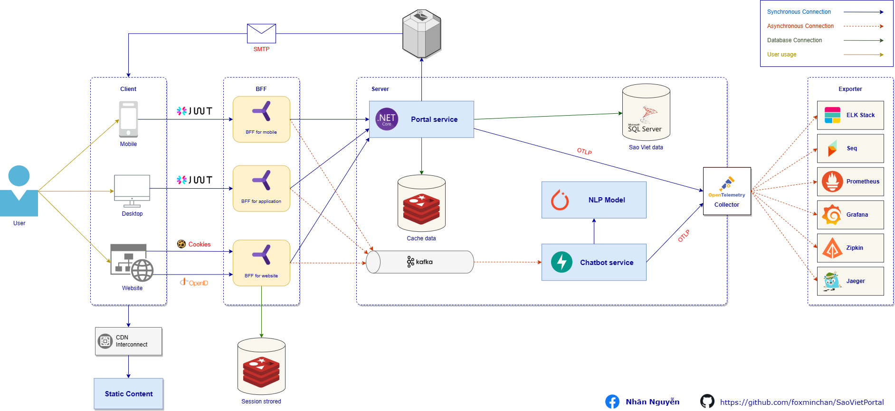

# Introduction

<div align="center">
    
    <h1>Sao Viet Portal</h1>
    <p>An open source portal built to manage student's information at Sao Viet.</p>
    &nbsp;
	&nbsp;
	&nbsp;
    &nbsp;
</div>

<p align="justify">
An <b>open-source</b> portal called Sao Viet is being developed for student information management. It handles tasks such as admission, enrollment, attendance, grades, and more. It's a <b>university graduation</b> project with no commercial purpose. HUTECH University is not liable for any damages caused by the use of this project.
</p>

## Features

- [x] Manage student's information, including personal information, academic information, and financial information.
- [x] Manage teacher information, including their personal details, qualifications, and employment history
- [x] Manage the different branches of the center, including their location, contact details, and available courses
- [x] Keep track of the center's financial activities, including income and expenses
- [x] Generate statistical data and reports based on the information stored in the system
- [x] Provides users with interactive chatbot interface that can assist with common queries and tasks
- [ ] Follow the center's teachers and students `(requires IoT devices)`
- [ ] Manage the assets of the center, including equipment, furniture, and other resources `(requires Grantt chart)`
- [ ] Analyze the center's financial data and generate revenue predictions based on trends and patterns
- [ ] Provide more advanced chatbot capabilities, using the latest GPT-4 technology
- [ ] Store student data on a secure blockchain platform, ensuring the privacy and security of sensitive information

## Technologies

### Technical stack

- **[.NET Core](https://dotnet.microsoft.com/download/dotnet/7.0)** - A free, cross-platform, open source developer platform for building many different types of applications.
- **[Python 3.11](https://www.python.org/downloads/release/python-3110/)** - An interpreted, high-level, general-purpose programming language.

### Tools and library

#### 💻 Infrastructure

- **[Windows 11](https://www.microsoft.com/en-us/windows/windows-11)** - The operating system for developing and building this application.
- **[WSL 2 - Ubuntu 22.04.2 LTS](https://docs.microsoft.com/en-us/windows/wsl/install)** - The subsystem for Linux to run Linux on Windows.
- **[Docker Desktop (Kubernetes enabled)](https://www.docker.com/products/docker-desktop)** - The containerization platform to run the appliation.
- **[Kubernetes](https://kubernetes.io/)** / **[AKS](https://azure.microsoft.com/en-us/services/kubernetes-service/)** / **[Nomad](http://www.nomadproject.io/)** - The container orchestration system to deploy the application.
- **[helm](https://helm.sh/)** - The package manager for Kubernetes to install the application.
- **[tye](https://github.com/dotnet/tye)** - The tool to run the application locally.
- **[Postman](https://www.postman.com/)** / **[Insomnia](https://insomnia.rest/)** / **[REST Client](https://marketplace.visualstudio.com/items?itemName=humao.rest-client)** - The tool to test the application.

#### 🛠️ Backend

- **[.NET Core 7.0](https://dotnet.microsoft.com/download/dotnet/7.0)** - A free, cross-platform, open source developer platform for building many different types of applications.
- **[Duende BFF](https://duendesoftware.com/products/identityserver)** - A free, open source OpenID Connect and OAuth 2.0 framework for ASP.NET Core.
- **[EF Core](https://docs.microsoft.com/en-us/ef/core/)** - A modern object-database mapper for .NET.
- **[OpenTelemetry](https://opentelemetry.io/)** - A set of open source tools for monitoring and tracing applications.
- **[Serilog](https://serilog.net/)** - A diagnostic logging library for .NET applications.
- **[FluentValidation](https://fluentvalidation.net/)** - A popular .NET library for building strongly-typed validation rules.
- **[AutoMapper](https://automapper.org/)** - A convention-based object-object mapper.
- **[Lucene.NET](https://lucenenet.apache.org/)** - A high-performance, full-featured text search engine library.
- **[FastAPI](https://fastapi.tiangolo.com/)** - A modern, fast (high-performance), web framework for building APIs with Python 3.6+ based on standard Python type hints.
- **[Pytorch](https://pytorch.org/)** - An open source machine learning framework that accelerates the path from research prototyping to production deployment.
- **[Apache Kafka](https://kafka.apache.org/)** - A distributed streaming platform.

#### 🖥️ Frontend

- **[.NET MAUI](https://dotnet.microsoft.com/en-us/apps/maui)** - Build native, cross-platform desktop and mobile apps all in one framework.
- **[Blazor](https://dotnet.microsoft.com/apps/aspnet/web-apps/blazor)** - A free, open source framework for building client web apps with .NET.
- **[Docusaurus](https://docusaurus.io/)** - Build optimized websites quickly, focus on your content.

#### 📦 Optional tools

- **[Visual Studio 2022](https://visualstudio.microsoft.com/vs/)** - The IDE for developing and building this application.
- **[SQL Server 2022](https://www.microsoft.com/en-us/sql-server/sql-server-downloads)** - The relational database management system to store data.
- **[Laragon](https://laragon.org/)** - Modern & Powerful - Easy Operation.
- **[Resharper](https://www.jetbrains.com/resharper/)** - The Visual Studio extension for .NET developers.
- **[PyCharm](https://www.jetbrains.com/pycharm/)** - The Python IDE for Professional Developers.

## Development

Clone the repository to your local machine

```bash
git clone https://github.com/foxminchan/SaoVietPortal.git
```

Make sure you have installed the tools and libraries listed in the [Technical stack](#technical-stack) section.

## Contributing

<p align="justify">
We welcome contributions from the community. If you would like to contribute to this project, please read our <a href="https://github.com/foxminchan/SaoVietPortal/blob/main/.github/CONTRIBUTING.md">contributing guidelines</a> for more information.
</p>

Thanks goes to these wonderful people ([emoji key](https://allcontributors.org/docs/en/emoji-key))

<div align="center">
<table>
  <tbody>
    <tr>
      <td align="center">
        <a href="https://github.com/foxminchan">
          
          <br />
          <sub>
            <b>Nguyen Xuan Nhan</b>
          </sub>
        </a>
        <br />
				<span title="Ideas, Planning, & Feedback">🤔</span>
        <a href="https://github.com/foxminchan/SaoVietAPI/commits?author=foxminchan" title="Code">💻</a>
				<span title="Documentation">📖</span>
				<span title="Tests">⚠️</span>
				<span title="Maintenance">🚧</span>
				<span title="Bug reports">🐛</span>
      </td>
      <td align="center">
        <a href="https://github.com/lycaphe8x">
          
          <br />
          <sub>
            <b>Nguyen Dinh Anh</b>
          </sub>
        </a>
        <br />
        <span title="Guide">🧑‍🏫</span>
				<span title="Business">💼</span>
				<span title="User testing">📓</span>
      </td>
    </tr>
  </tbody>
</table>
</div>

## Architecture model


